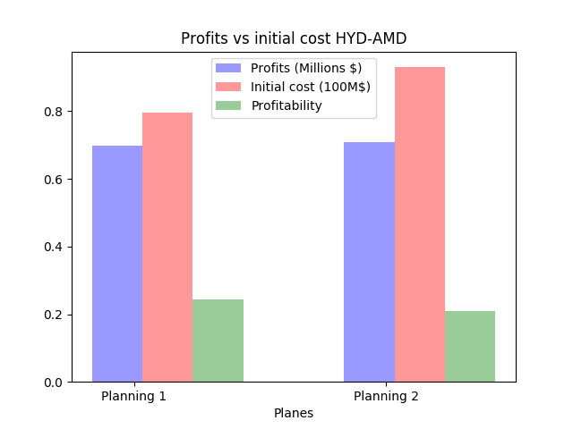

# AMTools 0.6.0

### Introduction
 
General purposes scripts for Airlines-Manager 2 airline management simulation. Theses scripts are designed to help you
to make rational decision while expanding your airline and accurately visualize the results of your strategy.
 They give you many indicators and plots to evaluate impact
of your decisions.

### Features

- Planes, Hub and Lines object data model
- Financial reporting API to visualize financial data and process theses
- Lines evaluation API to evaluate benefits for your lines and find the planes that matches the best with.
- User-friendly Plotting API

Thanks to https://openflights.org/ for providing free flights databases.

### Install

Install procedures requires some work. The helpers scripts uses scrapped data from your AM2 account. That means you'll
have to download specific html pages before using theses scripts.
Follow theses steps:

-   Clone the project. You must have matplotlib, numpy, scipy and AdvancedHTMLParser libraries installed.
    The project runs on python 3.6 or later.

-   To use helper scripts you have to manually download web pages from Airline-Manager and put theses in specifics directories :

    -   Create the following directories inside project root
        ```commandline
        $ mkdir scrap
        $ cd scrap
        $ mkdir marketing network newline planes
        ```
    -   Fill the `plane` directory. Go to [purchase new plane page](https://www.airlines-manager.com/aircraft/buy/new) and download html page for 
        each plane range eg. mid-range, long-range by right clicking on link for each range. Put the downloaded files into
        planes directory.
        
    -   Fill the `marketing` directory. Go to  [pricing management page](https://www.airlines-manager.com/marketing/pricing/).
        For each line click right on the line details icon and download the html page. Put the files into the marketing directory.
        
    -   Fill the `network` directory the same way as the `marketing` but download pages from [network management page](https://www.airlines-manager.com/network/)
    
    -   Fill the `newline` directory. Go to the [newline page](https://www.airlines-manager.com/network/newline) and for each
        country you want to make prevision go to the step 2 (arrival airport) page and download it. You must have purchase external audits to
        make previsions on new lines. Name the downloaded pages by their country names. And add theses in `NEWLINE` constant array
        in scrap.py file.
        ```python
        NEWLINES = ["thailand.html", "india.html"]
        ```
    -   If you use AM2+ you can import .csv financial data given by the AM website. At project root, create a directory
        named `exports`. Download the last .csv financial report and put it into the `exports` directory.
        
After you first complete the install procedure, you only have to keep up to date the `network`, `marketing` directory
 when you open a new line and the `newline` when you purchase new external audits. If you use AM2+ you'll also have to
 to update your financial data.
 
- To update `network` and `marketing` directories just repeat steps 3 and 4 but download only the new lines pages.

- To update `newline` directory repeat step 5 for each country where you purchase external audits

- To update your financial data download export.csv file at least once a week to follow your airline accounting.

### Getting Started

The module contains three scripts : purchase.py, scrap.py and finance.py. After downloaded and installed the module, you can
run purchase.py to visualize performances over your lines and financial.py to your visualize financial data.

#### Purchase helper
If you often ask yourself how much planes and which types should I buy when opening this new line, you can know 
easily answer to this question :

```python

# Loads data from HTML pages
planes = scrap.planes_data()  
lines = scrap.lines_data()
newlines = scrap.newlines_data(lines)
data = purchase.Data(planes, newlines)

# Bar plot to evaluate profitability of each plane
purchase.Plot.sort(data)
```
This code plots evaluation of the planes for the lines you did not yet open. You must have purchased an external audit
to evaluate eventual new lines.



#### Financial reporting

You can get all commons accounting plots from data provided by AM2+ .csv files :

```python
data = finance.Data("export.csv") # Loads data from AM2+ exports
data.update() # Updating main data file
finance.Plot.raw(data) # Plots cash values
finance.Plot.rel(data) # Plots percents
finance.Plot.flow(data) # Plots cash flow
```

This code plots financial data such as the graph bellow :


The financial data are updated and concatenated on a json file `main.json` each time you load new data. 
It avoid conflicts by writing only most recent data and allows storing and processing of long term data (month, year, more).
