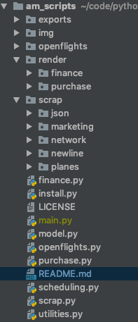

[](https://www.gnu.org/licenses/gpl-3.0)

# am_scripts 0.7.0

### Introduction

am_scripts provides **scheduling** and **strategic management** tools for airlines and more generally transports companies.
The project is designed around a simple airline model that fits with **Airlines-Manager 2** airline management simulation.

The goal is to *automate strategic and operational decision process for an airline*. With a given initial situation
(fleet, lines, ...) or a given capital,
**how can I make the better choices in terms of planes/lines purchases and planning?**

Use this project to help you make rational decision while expanding your AM2 airline 
and accurately visualize the performance of your strategy.

### Features

- **Planes, Hub and Lines** object data model with JSON interface
- **Accounting** data model with JSON and CSV interfaces
- **Planning** data model and generation of planning with different heuristic
- **Performance evaluation** API to visualize how to boost your fleet and which lines and planes to purchase.
- **Financial evaluation** API to visualize financial data and apply advanced processing.

Thanks to https://openflights.org/ for providing free flights databases to complete AM2+ data.

### Install

To install the project, you'll have to download specific html pages before using theses scripts. 
The framework requires scrapped data from your html pages generated with your AM2 account.
In order to do this follow these steps:

-   Clone the project. 

-   Create the following directories inside the project root: 

    

-   Connect to your AM2 acount

-   Download the pages to scrap:
    -   Fill the `planes` directory. Go to [purchase new plane page](https://www.airlines-manager.com/aircraft/buy/new) and download html page for 
        each plane range (short-range, mid-range, ...) by right clicking on link for each range. Put the downloaded files into
        planes directory.
        
    -   Fill the `marketing` directory. Go to  [pricing management page](https://www.airlines-manager.com/marketing/pricing/).
        For each line click right on the line details icon and download the html page. Put the files into the marketing directory.
        
    -   Fill the `network` directory the same way as the `marketing` but download pages from [network management page](https://www.airlines-manager.com/network/)
    
    -   Fill the `newline` directory. Go to the [newline page](https://www.airlines-manager.com/network/newline) and for each
        country you want to make prevision go to the step 2 (arrival airport) page and download it. You must have purchase external audits to
        make previsions on new lines. Name the downloaded pages by their country names. And add theses in `NEWLINE` constant array
        in scrap.py file.
        ```python
        NEWLINES = ["thailand.html", "india.html"]
        ```
    -   If you use AM2+ you can import .csv financial data given by the AM website. At project root, create a directory
        named `exports`. Download the last .csv financial report and put it into the `exports` directory.
        
    - Your if everything went well your `scrap` directory must looks like :
    
        
        
-   Once you've done, run the install.py script. This will scrap data from the html pages you've downloaded and write
    it to a more compact and quick to load JSON file. Do this each time you add new html data (eg. purchase a new line).
    
-   Install is finish, import scrap module on your scripts to load JSON data just created.
        
After you first complete the install procedure, you only have to keep up to date the `network` and`marketing` directories
 when you open a new line and the `newline` directory when you purchase new external audits for a line you did not yet
 purchased but plan to. If you use AM2+ you'll also have to update your financial data.
 
- To update `network` and `marketing` directories just repeat steps 3 and 4 but download only the new lines pages.

- To update `newline` directory repeat step 5 for each country where you purchase external audits

- To update your financial data download export.csv file at least once a week to follow your airline accounting.

### Getting Started

The framework contains two plotting modules : `purchase`, and `finance`. Theses have the same structure, they declare
a first class named `Data` that is used to handle concerned data and a second class `Plot` which is classic and is an
interface with matplotlib.

#### Purchase helper and planning comparison

If you often ask yourself how much planes and which types should I buy when opening this new line, the `purchase` module
is there to help you. It combines planning generations and lines/planes purchases features with financial previsions to
predict profitability of a given strategy.

Here is a simple example of code that compares two plannings. The first one is generated only by purchasing Q-400
and the second one by purchasing ER-190.

First instantiate lines, planes and plannings :
```python
import schedule as slg

# Instantiate two flat plannings
test_lines = scrap.JSON.lines
test_planes_q400 = [scrap.JSON.planes["Q-400"]]  # Fleet and planning contains only Q-400
test_planes_erj190 = [scrap.JSON.planes["ERJ-190"]]  # Fleet and planning contains only ERJ-190
plan_400 = slg.FlatPlanning.match(test_lines, test_planes_q400)
plan_erj190 = slg.FlatPlanning.match(test_lines, test_planes_erj190)
```

Then create a `purchase.Data` object with a list of the plannings to compare and we plot it.

```python
# Bar plot to compare profitability of each plane for the two flat plannings
purchase_data = purchase.Data([plan_400, plan_erj190])
purchase.Plot.sorted(purchase_data)
```

This code plots evaluation of the plannings for all the lines you owned or purchased audit.


#### Financial reporting

Once you've downloaded your fresh financial data you can process theses and plot the result.
You can get all commons accounting graphs and visualization from data provided by AM2+ .csv files.

Here is a simple code that plots your relative and absolute accounting data 

```python
data = finance.Data("export.csv") # Loads data from AM2+ exports
data.update() # Updating main data file
finance.Plot.raw(data) # Plots cash values
finance.Plot.rel(data) # Plots percents
finance.Plot.flow(data) # Plots cash flow
```

This code plots financial data such as the graph bellow :


The financial data are updated and merged on a json file `main.json` each time you load new data. 
It avoid conflicts by writing only most recent data and allows automate storing and processing of long term data (month, year, more).

**Reporting period**

You can plot your financial data over different periods. You can choose the start date, end date of the plots
and the period (weekly/monthly). To do this you have to specify theses parameters when constructing the `finance.Data`
object.

Here is a simple example code that plots weekly financial data instead of daily ones you've plotted before :

```python
data = finance.Data("export.csv", period="week")
```

Your can also specify the period as an integer representing the interval between data to plot.

#### Generate schedules

Planning objects does not provides any schedule generation features. You can use theses to externally generate your own
schedule :
```python
lines = {"HYD": {"BLR" : scrap.JSON.lines["HYD"]["BLR"]}}
planes = {"HYD-BLR-1" : scrap.JSON.planes["Q-400"]}
planes["HYD-BLR-1"].id = "HYD-BLR-1"

schedule = {"HYD-BLR-1": [["HYD-BLR"] * 6] * 7}
```

The last line of code instantiate the schedule. It contains for each plane a week schedule that is an array of 7
day schedules. Here you can note that daily schedules are identical and contains 6 flights from Hyderbad International (HYD)
to Kempegowda International Airport (BLR).

Then you can instantiate a planning object using the previously created schedule:

```python
import shedule as slg

plan = slg.Planning(lines, planes, schedule)
```

If you want to generate more sophisticated schedules you can check at `FlatPlanning` class or write a personalized
method to compute your schedule with given fleet and lines.

### Additional information

**Python 3.6**

**Dependencies**
- matplotlib
- numpy
- scipy
- AdvancedHTMLParser
- seaborn

Install theses PyPi packages into your Python environment before launching script

**Copyright :** &copy; 2019 Sami Dahoux [(GitHub)](https://github.com/samiBendou/), All Rights Reserved

**Last Update :** 11/02/2019

**Version log :**
- 0.7.0 : Main features release and final code structure of the project