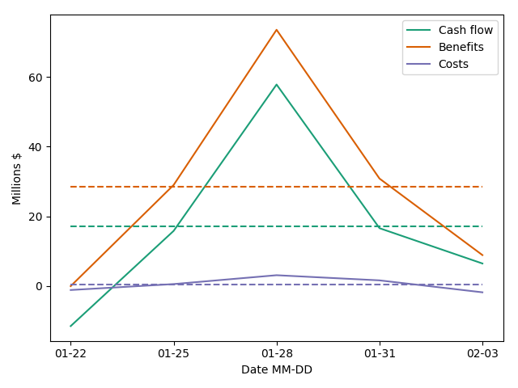

# AMTools 0.2.0

### Introduction 
General purposes scripts for Airlines-Manager 2 airline management simulation. Theses scripts are designed to help you
to make rational decision while expanding your airline. They give you many indicators and plots to evaluate costs impact
of your decisions.




### Features

- Financial reporting API to visualize financial datas and process theses
- Strategical management tools API to visualize lines performances and evaluates new lines opportunities

### Install

Follow theses steps:

-   Clone the project. You must have matplotlib, numpy, scipy and AdvancedHTMLParser libraries installed a python 3.6 or later environment.

-   To use the scripts you have to manually download web pages from Airline-Manager and put theses in specifics directories :

    -   Create three directories inside project root
        ```commandline
        $ mkdir scrap
        $ cd scrap
        $ mkdir marketing network newline planes
        ```
    -   Fill the `plane` directory : go to [buy new plane page](https://www.airlines-manager.com/aircraft/buy/new) and download html page for 
        each plane range eg. mid-range, long-range by right clicking on link for each range. Put the downloaded files into
        planes directory.
        
    -   Fill the `marketing` directory : go to  [pricing management page](https://www.airlines-manager.com/marketing/pricing/).
        For each line click right on the lines details link and download the html. Put the files into the marketing directory.
        
    -   Fill the `network` directory  the same way as the `marketing` but download pages from [network management page](https://www.airlines-manager.com/network/)
    
    -   Fill the `newline` directory : go to the [newline page](https://www.airlines-manager.com/network/newline) and for each
        country you want to make prevision go to the step 2 page and download it. You must have buy external audits to
        make previsions. Name the downloaded pages by their country names. And add theses in the scrap.py `NEWLINE` constant
        ```python
        NEWLINES = ["thailand.html", "india.html"]
        ```
    -   If you use AM2+ you can import .csv financial datas given by the AM website. A project root, create a directory
        named `exports`. Download the last .csv financial report and put it into the `exports` directory.

### Getting Started

The module contains three scripts : main.py, scrap.py and finance.py. After downloaded and installed the module, you can
run main.py to visualize performances over lines and financial.py to visualize financial data.

#### Demand prevision for a line

If you often ask yourself how much planes and which types should I buy when opening this new line, this main.py can provide
you a rational evaluation.

Set the constant parameter `plot_{new, old}_lines` on True and visualize which are the most profitable planes and lines.

####     Financial reporting

Launch the financial.py script, it loads the last export.csv. Modify the filename in the script according to the name of
the export downloaded file. set `plot_when_get` on True to plot the financial data when getting it.

The financial data can be updated and are concatenated on a json file each time you load new data. It avoid conflicts
by write only most recent data. Since the .csv interface of AM2+ gives you only weekly reports you have to download a 
export.csv a least once a week to get a day by day watching.